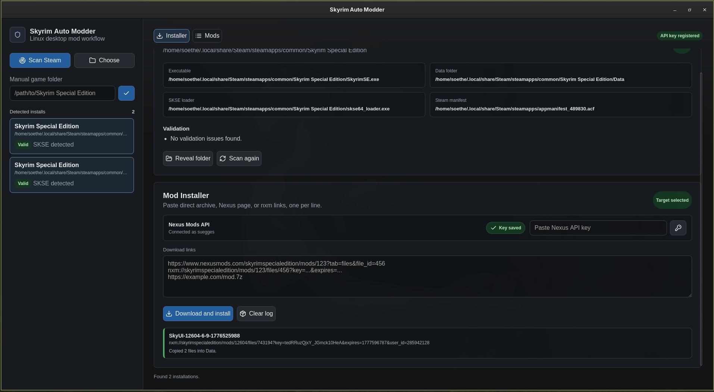

# Skyrim Auto Modder

Desktop app for a local Skyrim Special Edition modding workflow on Linux.



## What It Does

Skyrim Auto Modder detects local Steam installations of Skyrim Special Edition, validates the game folder, downloads mod archives, extracts them, and copies files into the correct game locations.

It supports:

- Steam Skyrim Special Edition install detection.
- Manual Skyrim folder selection.
- Nexus Mods API key validation and local storage.
- Nexus page URLs, direct archive URLs, and `nxm://` Mod Manager Download links.
- `nxm://` deep-link registration so Nexus can open the desktop app.
- Local archive copies for reinstalling later.
- Installed mod manifests for tracking files copied by the app.
- Safer uninstall for tracked mods.
- Persistent install/uninstall logs.
- Special handling for SKSE runtime archives.

## Screenshot

Save the current app screenshot as:

```text
docs/app-screenshot.png
```

The README image above will render from that file.

## Requirements

- Linux desktop environment with Steam installed.
- Skyrim Special Edition installed through Steam.
- `bsdtar` available on PATH for archive extraction.
- Node.js and npm for development.
- Rust and Cargo for the Tauri backend.

## Development

```bash
npm install
npm run tauri dev
```

Build checks:

```bash
npm run build
cd src-tauri
cargo check
```

## Nexus Mods

Nexus Mods links are supported after saving a Nexus Mods API key in the app. The key is validated with the Nexus API and stored locally at:

```text
.local/skyrim-auto-modder/nexus.json
```

Supported inputs:

- `https://www.nexusmods.com/skyrimspecialedition/mods/123?tab=files&file_id=456`
- `nxm://skyrimspecialedition/mods/123/files/456?key=...&expires=...`
- `https://www.nexusmods.com/skyrimspecialedition/mods/123`
- `https://example.com/mod.7z`

Direct Nexus page URLs use the API download endpoint and require Premium download access. For non-Premium accounts, use **Mod Manager Download** on Nexus and let the browser open `nxm://` links with Skyrim Auto Modder.

The app registers itself as the `nxm://` handler when it starts on Linux/Windows. Open the app once, then click **Mod Manager Download** in the browser and choose Skyrim Auto Modder when prompted.

## Local Data

Local app data is intentionally kept out of Git through `.gitignore`.

```text
.local/skyrim-auto-modder/nexus.json
.local/skyrim-auto-modder/install-log.json
.local/skyrim-auto-modder/archives/
.local/skyrim-auto-modder/installed-mods/
```

The archive store keeps downloaded mod files for reinstalling later. The installed-mod manifests track copied files and whether each destination existed before installation.

## Uninstall Behavior

The Mods tab lists mods installed by this app. Uninstall uses the local manifest and removes only files the app copied.

Files that already existed before a mod was installed are preserved to reduce the chance of breaking the game or another mod.

## SKSE Handling

SKSE runtime archives are handled differently from normal Data-folder mods:

- `skse64_loader.exe` and `skse64_*.dll` go beside `SkyrimSE.exe`.
- Bundled scripts go into `Data/Scripts`.
- Source folders are not copied into the game folder.

After installing SKSE, use **Scan again** to refresh the detected SKSE status.
